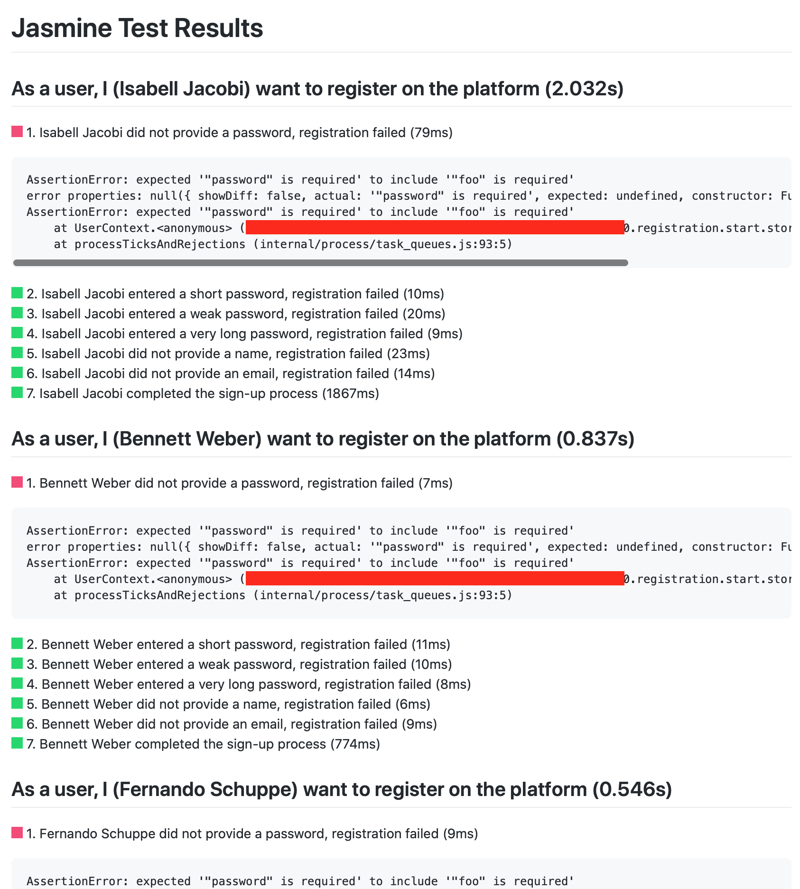
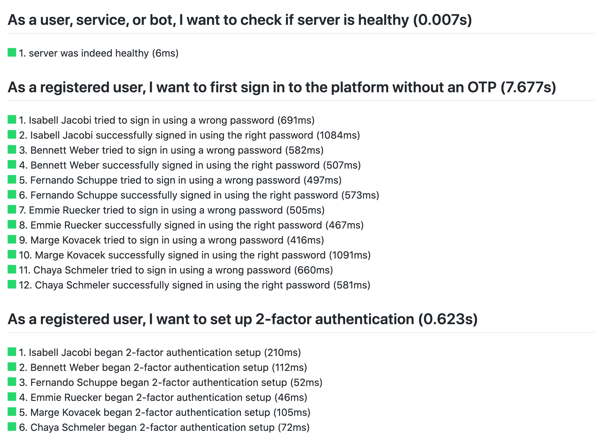
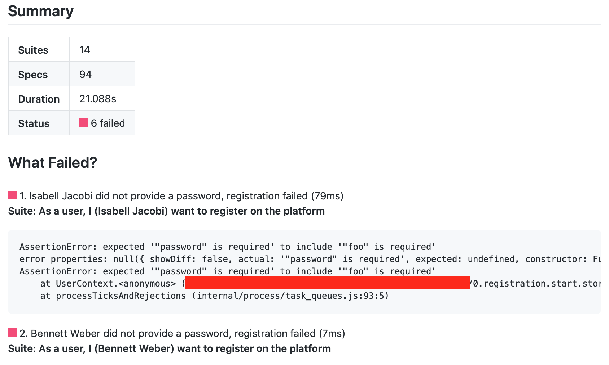

# Jasmine Markdown Reporter

Generates jasmine test report as a single document that can live in your project. Uses Github-flavored markdown.

## Quickstart

```
npm install jasmine-markdown-reporter --save-dev
```

```javascript
const path = require('path')
const MarkdownReporter = require('jasmine-markdown-reporter')

global.jasmine.getEnv().clearReporters()
// add other reporters

global.jasmine.getEnv().addReporter(new MarkdownReporter({
  title: 'Jasmine Test Results',
  destination: path.join(process.cwd(), 'spec.md')
}))
```

and then run

```
jasmine
```


produces a report `spec.md` on your project root directory which looks something like this



## Passing Tests

look like this




## Test Summary

looks like this



